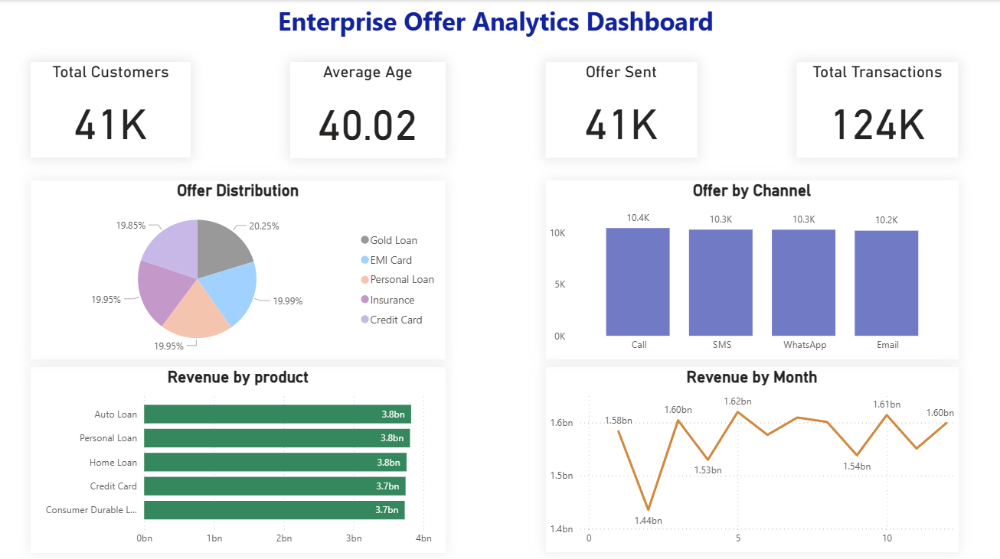
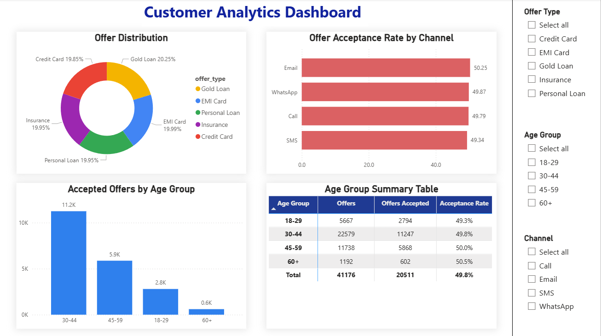

# Enterprise Customer Offer Analytics Platform

> **End-to-End Data Engineering & Business Intelligence Project using Databricks, PySpark, SQL, Delta Lake, and Power BI**


---

# 📊 Dashboard Preview

## Executive Overview Dashboard




---

## Customer Insights Dashboard




---

# 📌 Project Overview

This project demonstrates an end-to-end **Data Engineering and Business Intelligence pipeline** using the **Medallion Architecture (Bronze, Silver, Gold)**.

Raw enterprise banking datasets are ingested into **Databricks**, processed using **PySpark**, transformed into business-ready Gold tables, and visualized through interactive **Power BI dashboards**.

The project simulates a real-world analytics solution used by financial institutions to monitor customer behavior, offer performance, revenue trends, and business KPIs.

---

# 🎯 Business Problem

Banks and financial institutions generate large volumes of customer, offer, and transaction data.

Business teams need a centralized analytics solution to answer questions such as:

- How many customers received offers?
- Which offer types are most popular?
- Which communication channel performs best?
- Which age group accepts offers the most?
- Which products generate the highest revenue?
- How does revenue trend throughout the year?

This project provides those insights through an automated analytics pipeline and interactive dashboards.

---

# 🏗️ Solution Architecture

```text
                  Raw CSV Files
                        │
                        ▼
            Bronze Layer (Raw Data)
                        │
                        ▼
      Silver Layer (Cleaning & Transformation)
                        │
                        ▼
      Gold Layer (Business Aggregated Tables)
                        │
                        ▼
             Power BI Interactive Dashboard
```

## Data Pipeline Workflow

1. Raw CSV files are ingested into Databricks (Bronze).
2. Data is cleaned, validated, and standardized in the Silver layer.
3. Business aggregations are created in the Gold layer.
4. Gold tables are exported as CSV files.
5. Power BI connects to Gold datasets to build interactive dashboards.


---

# 🏛️ Medallion Architecture

## 🥉 Bronze Layer

- Raw CSV ingestion
- Schema validation
- Delta table creation
- No transformations

---

## 🥈 Silver Layer

- Data cleansing
- Null handling
- Standardized column names
- Data quality improvements
- Business rule validation

---

## 🥇 Gold Layer

Business-ready analytical tables:

- Customer Summary
- Offer Summary
- Product Summary
- Channel Summary
- Age Group Summary
- Monthly Transaction Summary
- Transaction Summary

These tables are directly connected to Power BI.

---

# ⚙️ Technologies Used

| Technology | Purpose |
|------------|----------|
| Python | Data Processing |
| PySpark | ETL Pipeline |
| Databricks | Data Engineering |
| SQL | Business Analytics |
| Delta Lake | Data Storage |
| Power BI | Dashboard & Reporting |
| Git & GitHub | Version Control |

---

# 📂 Dataset

This project uses synthetic enterprise banking datasets including:

- Customer Data
- Offer Data
- Transaction Data
- Product Data
- Communication Channel Data

---

# 📈 Dashboard 1 – Executive Overview

This dashboard provides high-level business KPIs for executives.

### Key Metrics

- Total Customers
- Average Customer Age
- Total Offers Sent
- Total Transactions

### Visualizations

- Offer Distribution
- Offer by Communication Channel
- Revenue by Product
- Monthly Revenue Trend

---

# 📊 Dashboard 2 – Customer Insights

This dashboard focuses on customer behavior and offer performance.

### Visualizations

- Offer Distribution
- Offer Acceptance Rate by Channel
- Offer Acceptance by Age Group
- Age Group Summary Matrix

### Interactive Filters

- Offer Type
- Age Group
- Communication Channel

---

# 💡 Key Business Insights

- Over **41,000 customers** were analyzed.
- More than **124,000 transactions** were processed.
- Average customer age is approximately **40 years**.
- Offer acceptance rate is around **50%** across communication channels.
- Gold Loan and EMI Card contribute the largest share of offers.
- Monthly revenue remains relatively stable throughout the year.

---

# 📁 Project Structure

```text
Enterprise-Customer-Offer-Analytics/
│
├── datasets/
│   └── raw/
│       └── customers_raw.csv
│
├── docs/
│   ├── data_dictionary.md
│   └── project_workflow.md
│
├── notebooks/
│   ├── 00_data_profiling.py
│   ├── 01_Data_Ingestion.py
│   ├── 02_Bronze_ETL.py
│   ├── 03_Silver_ETL.py
│   ├── 04_Data_Quality.py
│   ├── 05_Gold_ETL.py
│   ├── 06_SQL_Analytics.sql
│   ├── 07_Query_Optimization.py
│   └── 08_PowerBI_Export.py
│
├── powerbi/
│   ├── data/
│   ├── screenshots/
│   │   ├── executive_dashboard.png
│   │   └── customer_analytics_dashboard.png
│   └── offerManagement.pbix
│
├── sql/
│
├── src/
│   ├── api/
│   ├── pipelines/
│   ├── utils/
│   └── tests/
│
├── README.md
├── requirements.txt
└── .gitignore
```

---

# 🚀 Features

- End-to-End ETL Pipeline
- Medallion Architecture
- PySpark Transformations
- SQL Business Analytics
- Delta Lake Storage
- Interactive Power BI Dashboards
- Executive KPI Reporting
- Customer Analytics
- Interactive Filters & Slicers

---

# 🎯 Skills Demonstrated

This project showcases practical skills in:

- Data Engineering
- ETL Pipeline Development
- PySpark
- SQL
- Databricks
- Delta Lake
- Data Modeling
- Business Intelligence
- Power BI Dashboard Development
- Data Visualization
- Git Version Control

---

# 📷 Dashboard Screenshots

## Executive Overview


---

## Customer Insights


---

# 👩‍💻 Author

**Amreen**

📧 Email: amreenbegum75789@gmail.com

🔗 LinkedIn: https://linkedin.com/in/amreen--begum
